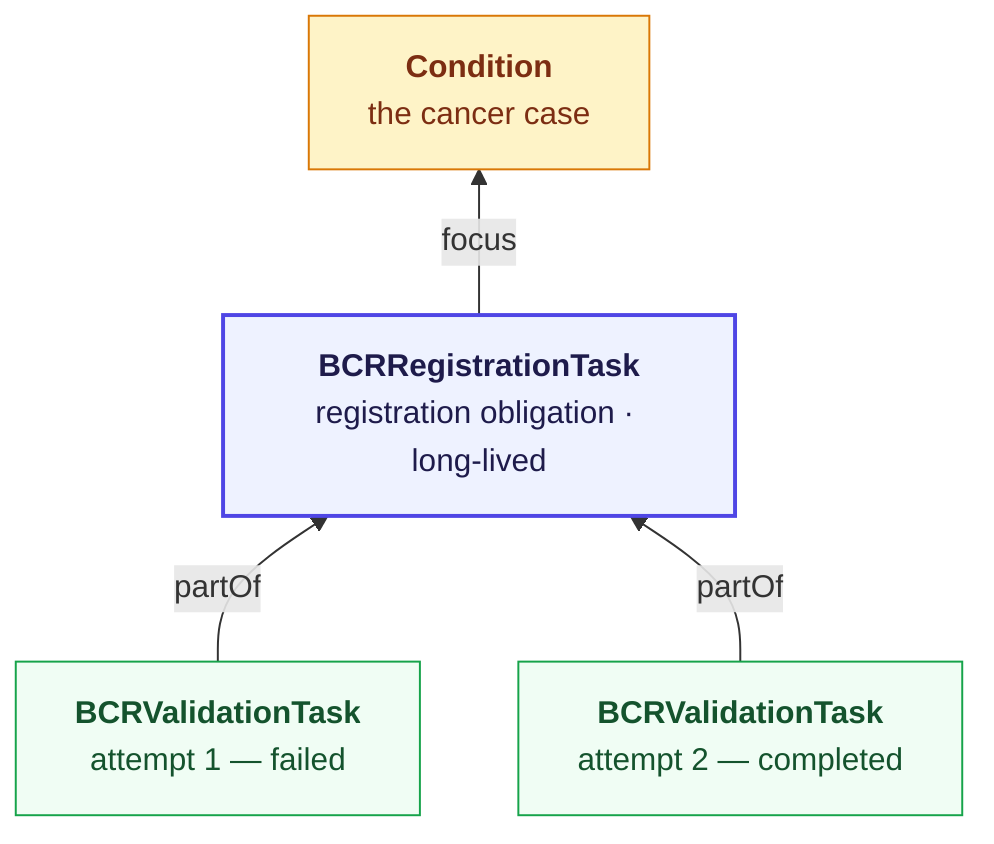
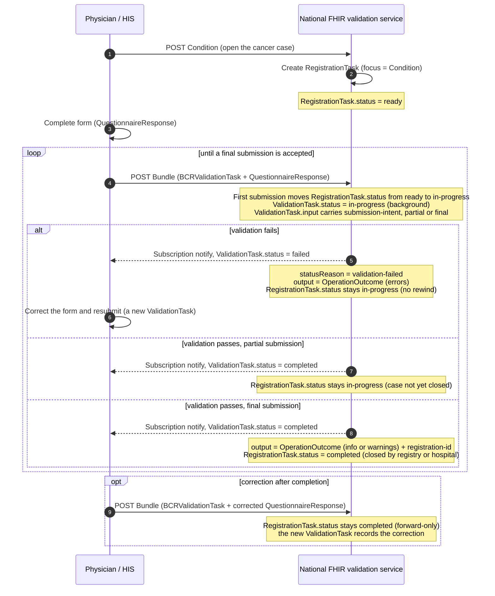
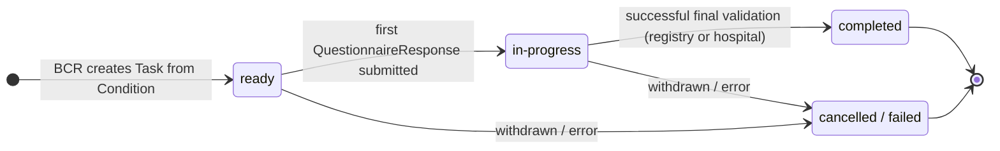
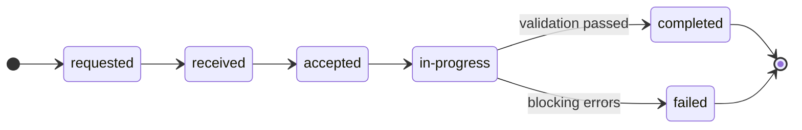

This page describes a **FHIR-native submission channel** for the clinical cancer
registration (Stream 1 on the [Data flow](dataflow.html) page). Instead of manual
web entry or HIS batch extraction through WBCR, a hospital system submits the
completed registration form to a national FHIR server, which validates it
**asynchronously** and reports the result back on a FHIR `Task`.

> This is a forward-looking design proposal. It is **draft** and must be
> confirmed with BCR before any production use.

### What this flow does

1. The hospital posts a **Condition** (the cancer case) to the national FHIR server. The server creates the registration **Task** ([BCRRegistrationTask](StructureDefinition-bcr-registration-task.html)) from it — `status = ready` — to track the obligation to register the case; its `focus` points back at the Condition.
2. The coordinating physician completes the cancer registration **Questionnaire**, producing a **QuestionnaireResponse**.
3. The hospital submits the QuestionnaireResponse to the national FHIR server, which creates a per-attempt **validation Task** ([BCRValidationTask](StructureDefinition-bcr-validation-task.html)) declaring whether this is a **partial** or **final** submission. The first submission moves the registration Task to `in-progress`.
4. Validation runs in a **background process**. When it finishes, the result is attached to `Task.output` as an [OperationOutcome](StructureDefinition-bcr-validation-outcome.html), and the validation Task's `status` is set to `completed` or `failed`.
5. The hospital is notified of the result through a **Subscription** (or by polling). After a successful **final** submission, either the registry or the hospital may close the registration Task (`completed`).

### Actors

| Actor | Role |
|---|---|
| Coordinating physician / HIS | Completes the form, submits, corrects and resubmits. |
| Belgian Cancer Registry | Imposes the registration obligation; requester of the registration Task. |
| National FHIR validation service | Receives submissions, runs background validation, owns the validation Task. |

### Design rationale: why a `Task`, not `Prefer: respond-async`

FHIR offers two ways to model an asynchronous job, and they are not
interchangeable:

- The **[Asynchronous Interaction Request pattern](https://hl7.org/fhir/R4/async.html)**
  (`Prefer: respond-async`, used by Bulk Data `$export`). The server returns
  `202 Accepted` with a `Content-Location` polling URL; the client polls that URL
  and gets back a **status JSON document**, not a FHIR resource. This handle is
  **ephemeral** — it carries no business semantics, is not itself searchable or
  subscribe-able as a resource, and disappears once the job is collected. It fits
  a one-shot, fire-and-forget export.
- A **`Task`** that is created on the server and whose `status` *is* the job
  status. The handle is a first-class, persistent, searchable resource: it can be
  watched with a Subscription, it carries typed `input`/`output`, and its history
  is an audit trail.

This IG uses the **`Task`** approach because the submission is none of the things
the `respond-async` pattern assumes. It is **long-lived and multi-attempt** (a
case is corrected and resubmitted until accepted), it must carry **business
intent** on the job itself (`partial` vs `final`), and — for a legally mandated
registry — it must leave a **durable, queryable audit trail** of every attempt
and outcome. A polling-URL status document cannot hold any of that; a `Task`
graph does. The created validation `Task` **is** the durable async job handle:
validation runs in the background, so the server returns immediately with the
Task in `received`/`accepted` and the hospital watches it to terminal state.

This is a well-trodden path, not a local invention. The
**[Da Vinci CDex Task-Based Approach](https://hl7.org/fhir/us/davinci-cdex/task-based-approach.html)**
models an asynchronous data request the same way — the requester creates a
`Task` (`status = requested`), the fulfiller drives it through
`in-progress → completed | failed | rejected`, results are returned in
`Task.output`, and the requester polls or subscribes — reusing the shared `Task`
profile and status value set from
**[Da Vinci HRex](https://hl7.org/fhir/us/davinci-hrex/)**. The same shape
appears in **Da Vinci PAS** (pended prior-authorization) and the FHIR
**[Workflow module](https://hl7.org/fhir/R4/workflow.html)**, where `Task` is the
resource whose `status` you watch to track fulfillment.

> Note the contrast with the synchronous **`$validate`** operation: `$validate`
> is structural and blocking, whereas this validation is asynchronous and applies
> cross-field oncology business rules — so it does not fit `$validate` either.

### Design principle: Task status moves *forward only*

A submission that can fail and be resubmitted looks, at first glance, like it
needs a `Task` whose status cycles back to an earlier state. It does not — and
the FHIR community is consistent that it should not. The Task state machine in
the [specification](https://hl7.org/fhir/R4/task.html#statemachine) is
illustrative and effectively forward-only: once a Task reaches a terminal state
(`completed`, `failed`, `cancelled`, `rejected`), it stays there. The idiomatic
way to "go back and redo" is a **new Task**, not a rewound status.

Two status axes are kept separate:

- **`QuestionnaireResponse.status`** — state of the *form data*. This first version does **not** rely on it (in particular it does not use `amended`): a correction is simply a new submission with a fresh `BCRValidationTask`.
- **`Task.status`** — state of the *validation/registration workflow*.

And the workflow is split into **two Tasks** so neither one ever has to move backwards:



Read the arrows as the FHIR reference: `BCRRegistrationTask.focus → Condition`
(the case the obligation is about) and `BCRValidationTask.partOf →
BCRRegistrationTask`. Each validation attempt is a **sub-task *of*** the single
registration obligation — not the reverse.

All of the back-and-forth of repeated attempts lives in the **history of
validation Tasks** — a new `BCRValidationTask` per attempt — never in a
backwards `status` transition or a cycling field on the registration Task. The
registration Task carries only its forward-only `status`; its current situation
(correction required, partially or fully accepted) is **derived** from the most
recent validation attempt. This also preserves a complete audit trail (attempt 1
failed, attempt 2 accepted), which matters for a legally mandated registry.

### Lifecycle



*Tip: click a participant box (**Physician / HIS** or the **validation service**) to open a menu of the related example resources.*

### State transition models

The registration obligation has a single, **forward-only** `status`; each
validation attempt is a separate short-lived Task with its own `status`. The
registration Task is never rewound — the back-and-forth of repeated attempts is
carried by the history of validation Tasks.

**`BCRRegistrationTask.status`** — forward-only; never rewinds:



**`BCRValidationTask.status`** — one short-lived machine per submission attempt;
a failed attempt is terminal, and a correction is simply a new Task:



### Status & output mapping

The registration Task carries only its forward-only `status`; the "derived
situation" column is **not stored** on the Task — it is inferred from the most
recent validation attempt (its `status`, `submission-intent` and `output`).

| Stage / result | `BCRValidationTask.status` | `BCRRegistrationTask.status` | Derived situation | `Task.output` |
|---|---|---|---|---|
| Case opened (Condition posted) | — | `ready` | awaiting data | — |
| Queued at server | `received` / `accepted` | `in-progress` | submitted | — |
| Validating | `in-progress` | `in-progress` | under validation | — |
| Valid, **partial** submission | `completed` | `in-progress` | partially accepted (case still open) | OperationOutcome (information) |
| Valid, **final** submission | `completed` | `completed` | accepted | OperationOutcome (information) + registration-id |
| Valid, warnings only (final) | `completed` | `completed` | accepted with warnings | OperationOutcome (warning) + registration-id |
| Invalid (blocking errors) | `failed` | `in-progress` | correction required | OperationOutcome (error) |
| System/processing error | `failed` | `in-progress` | correction required | OperationOutcome (exception) |
| Correction after completion | `completed` / `failed` | `completed` (unchanged) | correction → accepted | OperationOutcome (as above) |

**R4 note:** `Task.statusReason` is a `CodeableConcept` in R4 (it only became a
`CodeableReference` in R5), so it carries a [coded reason](CodeSystem-bcr-task-status-reason.html)
while the human-readable detail lives in the `OperationOutcome` referenced from
`Task.output`.

### Submitting

The registration Task already exists (the server created it from the posted
`Condition`), so each form submission just references it via `partOf`. The
hospital submits the validation Task and the QuestionnaireResponse atomically
as a **transaction Bundle** to the national server. Each validation Task declares
its `submission-intent` (`partial` or `final`):

```json
{
  "resourceType": "Bundle",
  "type": "transaction",
  "entry": [
    {
      "fullUrl": "urn:uuid:qr-1",
      "resource": { "resourceType": "QuestionnaireResponse", "status": "completed", "...": "..." },
      "request": { "method": "POST", "url": "QuestionnaireResponse" }
    },
    {
      "fullUrl": "urn:uuid:task-v-1",
      "resource": {
        "resourceType": "Task",
        "meta": { "profile": ["https://www.ehealth.fgov.be/standards/fhir/registries/bcr/StructureDefinition/bcr-validation-task"] },
        "status": "requested",
        "intent": "order",
        "code": { "coding": [{ "system": "https://www.ehealth.fgov.be/standards/fhir/registries/bcr/CodeSystem/bcr-task-code", "code": "validate-submission" }] },
        "partOf": [{ "reference": "Task/registration-task-1" }],
        "focus": { "reference": "urn:uuid:qr-1" },
        "input": [
          {
            "type": { "coding": [{ "system": "https://www.ehealth.fgov.be/standards/fhir/registries/bcr/CodeSystem/bcr-task-io", "code": "questionnaire-response" }] },
            "valueReference": { "reference": "urn:uuid:qr-1" }
          },
          {
            "type": { "coding": [{ "system": "https://www.ehealth.fgov.be/standards/fhir/registries/bcr/CodeSystem/bcr-task-io", "code": "submission-intent" }] },
            "valueCodeableConcept": { "coding": [{ "system": "https://www.ehealth.fgov.be/standards/fhir/registries/bcr/CodeSystem/bcr-submission-intent", "code": "final" }] }
          }
        ]
      },
      "request": { "method": "POST", "url": "Task" }
    }
  ]
}
```

The created validation `Task` **is** the durable async job handle (see *Design
rationale: why a `Task`* above): the server returns immediately with the Task in
`received`/`accepted`, and validation runs in the background.

### Getting the result — Subscription

The hospital is notified when a validation attempt reaches a terminal state. The
example uses a classic R4 rest-hook [Subscription](Subscription-ExampleBCRValidationSubscription.html):

```
criteria: Task?part-of=Task/<registration-task>&status=completed,failed
channel:  rest-hook  →  https://his.hospital-x.example/fhir/bcr/validation-callback
```

On notification the hospital reads the validation Task and its `output`
OperationOutcome; on failure it shows the issues (each `issue.expression` is a
FHIRPath into the submitted QuestionnaireResponse, so the UI can point the user
at the exact field), the physician corrects the form, and a new validation Task
is submitted.

Two resources are worth watching, and the hospital can use a Subscription **or**
polling for either:

- the **validation Tasks** — the per-attempt results (`completed` / `failed`), as above, from which the current situation is derived;
- the **registration Task** — its eventual closure (`status = completed`). Watch it with a second Subscription (`criteria: Task/<registration-task>`) or by polling `GET Task/<registration-task>`.

Alternatives: **polling** `GET Task/<id>` until terminal; or, for production
robustness, **topic-based subscriptions** via the [Subscriptions R5 Backport](https://hl7.org/fhir/uv/subscriptions-backport/)
IG (would add a `SubscriptionTopic` and a dependency — out of scope for this
draft).

### Worked example

A complete, resolvable example graph — attempt 1 fails on a missing topography,
the physician corrects, attempt 2 is accepted:

- Cancer case: [ExampleBCRCancerCondition](Condition-ExampleBCRCancerCondition.html) (the `Condition` the registration Task focuses on)
- Registration obligation: [ExampleBCRRegistrationTask](Task-ExampleBCRRegistrationTask.html) (`correction-required` mid-flow)
- Attempt 1 (failed): [ExampleBCRValidationTaskFailed](Task-ExampleBCRValidationTaskFailed.html) → [outcome](OperationOutcome-ExampleBCRValidationOutcomeFailed.html)
- Attempt 2 (accepted): [ExampleBCRValidationTaskAccepted](Task-ExampleBCRValidationTaskAccepted.html) → [outcome](OperationOutcome-ExampleBCRValidationOutcomeAccepted.html)
- Submitted form: [ExampleBCRSubmittedQuestionnaireResponse](QuestionnaireResponse-ExampleBCRSubmittedQuestionnaireResponse.html)
- Notification: [ExampleBCRValidationSubscription](Subscription-ExampleBCRValidationSubscription.html)

### Artifacts

| Profiles | Terminology |
|---|---|
| [BCRRegistrationTask](StructureDefinition-bcr-registration-task.html) | [BCR Task Code](CodeSystem-bcr-task-code.html) |
| [BCRValidationTask](StructureDefinition-bcr-validation-task.html) | [BCR Task Status Reason](CodeSystem-bcr-task-status-reason.html) |
| [BCRValidationOutcome](StructureDefinition-bcr-validation-outcome.html) | [BCR Task Input/Output Type](CodeSystem-bcr-task-io.html) |
| | [BCR Submission Intent](CodeSystem-bcr-submission-intent.html) |
