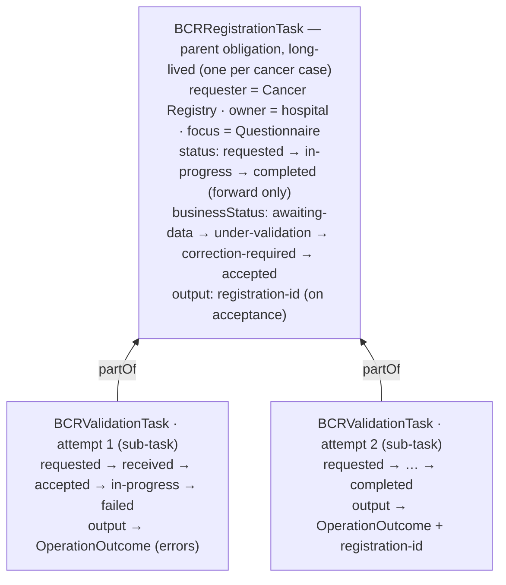
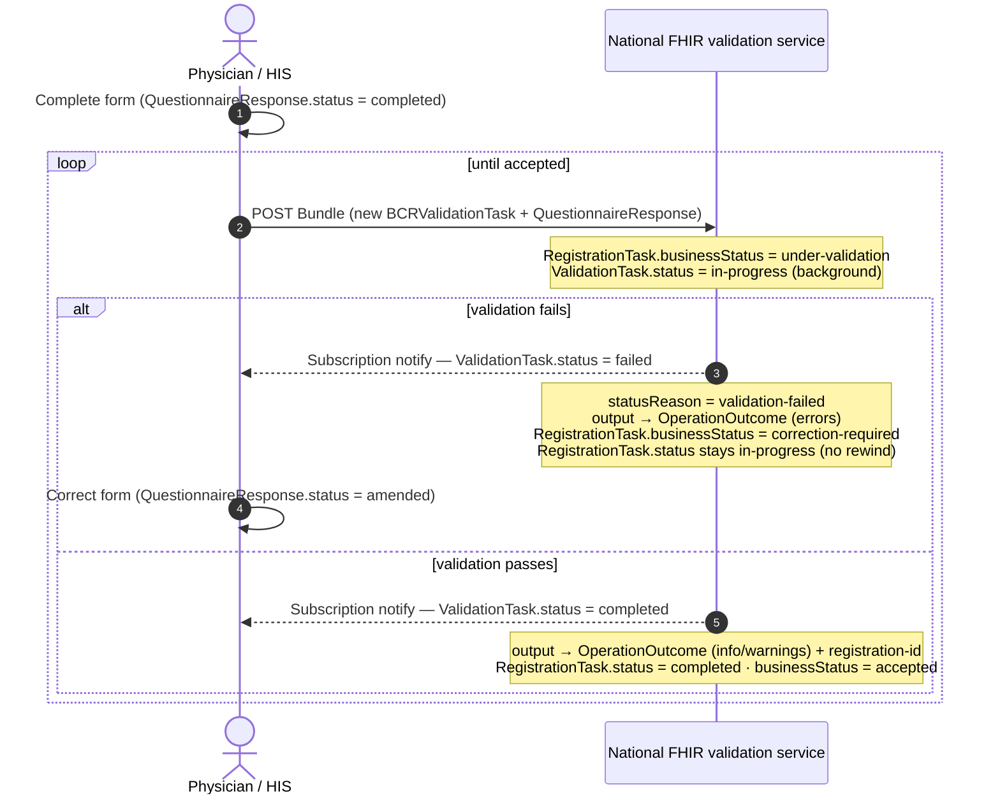

This page describes a **FHIR-native submission channel** for the clinical cancer
registration (Stream 1 on the [Data flow](dataflow.html) page). Instead of manual
web entry or HIS batch extraction through WBCR, a hospital system submits the
completed registration form to a national FHIR server, which validates it
**asynchronously** and reports the result back on a FHIR `Task`.

> This is a forward-looking design proposal. It is **draft** and must be
> confirmed with BCR before any production use.

### What this flow does

1. The coordinating physician completes the cancer registration **Questionnaire**, producing a **QuestionnaireResponse**.
2. The obligation to register the case is tracked with a **Task** ([BCRRegistrationTask](StructureDefinition-bcr-registration-task.html)).
3. The hospital submits the QuestionnaireResponse to the national FHIR server, which creates a per-attempt **validation Task** ([BCRValidationTask](StructureDefinition-bcr-validation-task.html)).
4. Validation runs in a **background process**. When it finishes, the result is attached to `Task.output` as an [OperationOutcome](StructureDefinition-bcr-validation-outcome.html), and the validation Task's `status` is set to `completed` or `failed`.
5. The hospital is notified of the result through a **Subscription**.

### Actors

| Actor | Role |
|---|---|
| Coordinating physician / HIS | Completes the form, submits, corrects and resubmits. |
| Belgian Cancer Registry | Imposes the registration obligation; requester of the registration Task. |
| National FHIR validation service | Receives submissions, runs background validation, owns the validation Task. |

### Design principle: Task status moves *forward only*

A submission that can fail and be resubmitted looks, at first glance, like it
needs a `Task` whose status cycles back to an earlier state. It does not — and
the FHIR community is consistent that it should not. The Task state machine in
the [specification](https://hl7.org/fhir/R4/task.html#statemachine) is
illustrative and effectively forward-only: once a Task reaches a terminal state
(`completed`, `failed`, `cancelled`, `rejected`), it stays there. The idiomatic
way to "go back and redo" is a **new Task**, not a rewound status.

Two status axes are kept separate:

- **`QuestionnaireResponse.status`** — state of the *form data* (`in-progress` → `completed` → `amended`).
- **`Task.status`** — state of the *validation/registration workflow*.

And the workflow is split into **two Tasks** so neither one ever has to move backwards:



Read the arrows as the FHIR reference: `BCRValidationTask.partOf → BCRRegistrationTask`.
Each validation attempt is a **sub-task *of*** the single registration obligation
(the parent on top) — not the reverse.

All of the back-and-forth of repeated attempts lives in the registration Task's
**`businessStatus`** (`correction-required`) and in the **history of validation
Tasks** — never in a backwards `status` transition. This also preserves a
complete audit trail (attempt 1 failed, attempt 2 accepted), which matters for a
legally mandated registry.

### Lifecycle



### Status & output mapping

| Validation result | `BCRValidationTask.status` | `BCRRegistrationTask.businessStatus` | `Task.output` |
|---|---|---|---|
| Queued at server | `received` / `accepted` | `submitted` | — |
| Validating | `in-progress` | `under-validation` | — |
| Valid, no issues | `completed` | `accepted` | OperationOutcome (information) + registration-id |
| Valid, warnings only | `completed` | `accepted-with-warnings` | OperationOutcome (warning) |
| Invalid (blocking errors) | `failed` | `correction-required` | OperationOutcome (error) |
| System/processing error | `failed` | `correction-required` | OperationOutcome (exception) |

**R4 note:** `Task.statusReason` is a `CodeableConcept` in R4 (it only became a
`CodeableReference` in R5), so it carries a [coded reason](CodeSystem-bcr-task-status-reason.html)
while the human-readable detail lives in the `OperationOutcome` referenced from
`Task.output`.

### Submitting

The hospital submits the validation Task and the QuestionnaireResponse atomically
as a **transaction Bundle** to the national server:

```json
{
  "resourceType": "Bundle",
  "type": "transaction",
  "entry": [
    {
      "fullUrl": "urn:uuid:qr-1",
      "resource": { "resourceType": "QuestionnaireResponse", "status": "completed", "...": "..." },
      "request": { "method": "POST", "url": "QuestionnaireResponse" }
    },
    {
      "fullUrl": "urn:uuid:task-v-1",
      "resource": {
        "resourceType": "Task",
        "meta": { "profile": ["https://www.ehealth.fgov.be/standards/fhir/registries/bcr/StructureDefinition/bcr-validation-task"] },
        "status": "requested",
        "intent": "order",
        "code": { "coding": [{ "system": "https://www.ehealth.fgov.be/standards/fhir/registries/bcr/CodeSystem/bcr-task-code", "code": "validate-submission" }] },
        "partOf": [{ "reference": "Task/registration-task-1" }],
        "focus": { "reference": "urn:uuid:qr-1" },
        "input": [{
          "type": { "coding": [{ "system": "https://www.ehealth.fgov.be/standards/fhir/registries/bcr/CodeSystem/bcr-task-io", "code": "questionnaire-response" }] },
          "valueReference": { "reference": "urn:uuid:qr-1" }
        }]
      },
      "request": { "method": "POST", "url": "Task" }
    }
  ]
}
```

The created validation `Task` **is** the durable async job handle — validation
itself happens in the background, so the server can return immediately with the
Task in `received`/`accepted`. (The synchronous `$validate` operation is *not*
appropriate here: it is structural and blocking, whereas this validation is
asynchronous and applies cross-field oncology business rules.)

### Getting the result — Subscription

The hospital is notified when a validation attempt reaches a terminal state. The
example uses a classic R4 rest-hook [Subscription](Subscription-ExampleBCRValidationSubscription.html):

```
criteria: Task?part-of=Task/<registration-task>&status=completed,failed
channel:  rest-hook  →  https://his.hospital-x.example/fhir/bcr/validation-callback
```

On notification the hospital reads the validation Task and its `output`
OperationOutcome; on failure it shows the issues (each `issue.expression` is a
FHIRPath into the submitted QuestionnaireResponse, so the UI can point the user
at the exact field), the physician corrects the form, and a new validation Task
is submitted.

Alternatives: **polling** `GET Task/<id>` until terminal; or, for production
robustness, **topic-based subscriptions** via the [Subscriptions R5 Backport](https://hl7.org/fhir/uv/subscriptions-backport/)
IG (would add a `SubscriptionTopic` and a dependency — out of scope for this
draft).

### Worked example

A complete, resolvable example graph — attempt 1 fails on a missing topography,
the physician corrects, attempt 2 is accepted:

- Registration obligation: [ExampleBCRRegistrationTask](Task-ExampleBCRRegistrationTask.html) (`correction-required` mid-flow)
- Attempt 1 (failed): [ExampleBCRValidationTaskFailed](Task-ExampleBCRValidationTaskFailed.html) → [outcome](OperationOutcome-ExampleBCRValidationOutcomeFailed.html)
- Attempt 2 (accepted): [ExampleBCRValidationTaskAccepted](Task-ExampleBCRValidationTaskAccepted.html) → [outcome](OperationOutcome-ExampleBCRValidationOutcomeAccepted.html)
- Submitted form: [ExampleBCRSubmittedQuestionnaireResponse](QuestionnaireResponse-ExampleBCRSubmittedQuestionnaireResponse.html)
- Notification: [ExampleBCRValidationSubscription](Subscription-ExampleBCRValidationSubscription.html)

### Artifacts

| Profiles | Terminology |
|---|---|
| [BCRRegistrationTask](StructureDefinition-bcr-registration-task.html) | [BCR Task Code](CodeSystem-bcr-task-code.html) |
| [BCRValidationTask](StructureDefinition-bcr-validation-task.html) | [BCR Task Business Status](CodeSystem-bcr-task-business-status.html) |
| [BCRValidationOutcome](StructureDefinition-bcr-validation-outcome.html) | [BCR Task Status Reason](CodeSystem-bcr-task-status-reason.html) |
| | [BCR Task Input/Output Type](CodeSystem-bcr-task-io.html) |
